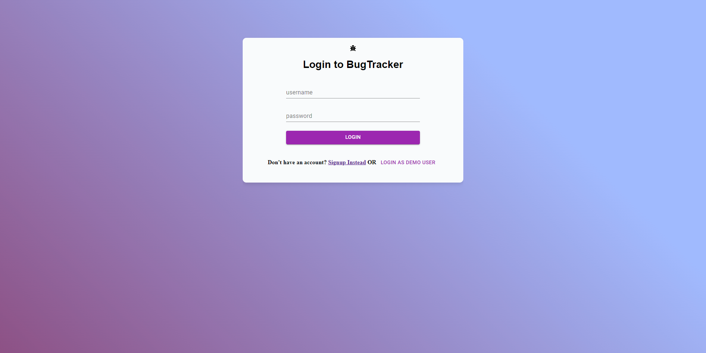

  # Bug Tracker

   [](https://opensource.org/licenses/MIT)

   [Heroku Live Link](https://peaceful-bastion-87144.herokuapp.com/)
  
  ## Table of Contents 

  * [Description](#description)

  * [Screenshots](#screenshots)
  
  * [Installation](#installation)
  
  * [Usage](#usage)
  
  * [Contributing](#contributing)

  * [License](#license)

  * [Questions](#questions)

  ## Description

  A project management tool to assign and delegate software bugs. The project was inspired by other project management tools like JIRA, Monday.com, and Azure Dev ops. 


  ## Screenshots

  ### Dashboard Page

  

  ### Create a Project  

  

  ### Project Page

  

  ### Create a Ticket 

  

    ### Landing Page

  


  ### Signup Page 

  

  ### Login Page

  


  
  ## Installation 

  To install the necessary dependencies, run the following command:
  
  ```Dependencies
   npm i
  ```  
  ## Usage

  You will need to install dependencies if you are going to try to upload the application on your local system.
  
  ## Contributing

  Please contact me via email if you wish to contribute.
  

  ## License

  This project is licensed under the MIT license 

  ## Questions
  
  If you have any questions about the repo, open an issue contact me directly at [midthun23@gmail.com](mailto:midthun23@gmail.com). You can find more work at [midth002](https://github.com/midth002)